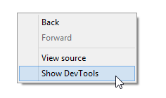
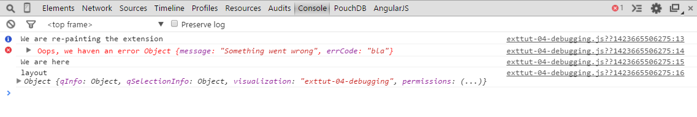

{{#comment}}

Console-log helper: http://www.briangrinstead.com/blog/console-log-helper-function
Blackbox solution: https://gist.github.com/paulirish/c307a5a585ddbcc17242

{{/comment}}

Before we continue improving our Hello World example I think it's now the right moment to talk a little bit about debugging.

In old days JavaScript developers often used [`alert()`](http://www.w3schools.com/jsref/met_win_alert.asp) to bring some debug messages to the front. Certainly you can still use this approach, but it becomes very soon more than annoying ... 
So there is a much better way: Using `console.log()` to send data to the **browser console**.

## Web Developer Tools

All modern browser offer some kind of a _Developer Tool_, Chrome is probably one step ahead their competitors, so I'll introduce some basic concepts here based on Chrome.

First of all you'll find a very good introduction to Chrome's [_Web DevTools_](https://developer.chrome.com/devtools) here.

### Developing using Qlik Sense Desktop & Chrome?
It is not in contradiction to using Qlik Sense Desktop to develop your visualization extensions and using the browser's developer tools at the same time.

#### Using your favorite browser
Even when developing using Qlik Sense Desktop you can use your favorite browser for debugging purposes at the same time:

1. Open Qlik Sense Desktop (and leave it openend)
2. Open your favorite browser and open `http://localhost:4848`

You'll see Qlik Sense' Hub and can open your browser's developer tools (most of the time by pressing `F12`).


#### Using developer tools within Qlik Sense Desktop
Since Qlik Sense Desktop is using Chromium as an embedded browser, you can also open Chrome's Web DevTools within Qlik Sense Desktop:

By using `Ctrl`+`Shift` and right mouse click you'll get the following dialog to activate _DevTools_:



## Chrome Web DevTools
There are a bunch of websites out there introducing the capabilities of developer tools, I just want to highlight three areas which are highly relevant when developing visualization extensions in Qlik Sense:

* Using the console
* Inspect elements
* Debugging

### Using the Console

As mentioned before, instead of triggering alerts, it's much more efficient and convenient to use the console of _Web DevTools_:

Just use console.info or console.log to push something to the console:

```javascript
paint: function ( $element, layout ) {

	var err = {
		message: 'Something went wrong',
		errCode: 'bla'
	};

	console.info( 'We are re-painting the extension' );
	console.error( 'Oops, we haven an error', err );
	console.log( 'We are here' );
	console.log( 'layout', layout );

}
```
results into



The console is very powerful, I can highly recommend that you spend some time with more "advanced" concepts of the console like:

```javascript
console.assert()
console.group()
console.groupCollapsed()
console.groupEnd()
console.table()
```

Further readings:

* https://developer.chrome.com/devtools/docs/console
* http://anti-code.com/devtools-cheatsheet/

#### But ...
Unfortunately not all browsers support ```console.xxx()``` so we'll definitely have to ensure that in a production environment there are no ```console.xxx()``` left in the code.

There are several strategies for achieving that:

1. Remove all ```console.xxx()``` manually  
Not really a nice solution, but certainly fine for the beginning
2. Wrap all your calls to `console` that they are only executed if the current browser supports `console`
3. Use tools like [Grunt](http://gruntjs.com/) or [Gulp](http://gulpjs.com/) to create a deployment process where all console statements will be removed automatically.

I personally prefer option 3 because it keeps the deployed code clean.


### Inspect Elements

### Debugging