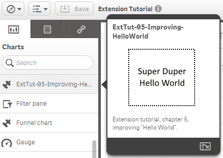

# Chapter 05 - Improving the Hello World Experience


OK, let's improve the _Hello World_ experience.
In this chapter we'll make the _Hello World_ example a bit more dynamic:

## Scope of this Chapter

* Changing the behavior by using the property panel:
	* Define the text displayed (not a hard coded "Hello World" anymore)
* Create a preview image to be displayed when clicking on the object in (left) object panel

## Making "Hello World" Dynamic
When building _Visualization Extensions_ it is essential that a non developer can use and configure the object like any other native object of Qlik Sense.
Therefore you can define which properties are exposed to the user in the (right) property panel and add additional custom properties which can then be used in your code.

If you have a look at the output of our very first "Hello World" example you'll recognize that the property panel looks as follows:


The "Appearance" accordion is enabled by default and available out of the box without doing anything. Now we'd like to inject just another text box into this accordion where we can define the output rendered:

**Desired result:**  


Therefore we add another object to the skeleton of the script file, called `definition`:

```javascript
define( [ /* dependencies */ ],
    function ( /* dependency arguments */ ) {
        'use strict';
        return {
			// Define how our property panel looks like
			definition: {

			},
			// Paint resp.Rendering logic
            paint: function ( $element, layout ) {
                // Your rendering code goes here ...             
            }
        };
    } );
```

Inside `definition` you can define how the property panel should look like, basically you can define the accordion, its sections and components to be used.
The default `definition` loads a reusable component called `settings`, therefore we see the "Appearance" accordion:

```javascript
definition: {
	type: "items",
	component: "accordion",
	items: {
		appearancePanel: {
			uses: "settings"
		}
	}
}
```

The line `uses: "settings"` defines here that the re-usable component `settings` should be used. I'll tell you more about other re-usable components in one of the upcoming chapters.

### A custom string property
To add a text box into the "Appearance" accordion, use the following code:

```javascript
...
definition: {
	type: "items",
	component: "accordion",
	items: {
		appearancePanel: {
			uses: "settings",
			items: {
				MyStringProp: {
					ref: "myDynamicOutput",
					type: "string",
					label: "Hello World Text"
				}
			}
		}
	}
},
...
```

**Code Explanation:**

* `MyStringProp` is the representation of our new custom object
	* `ref` defines the name to reference the new property in the code
	* `type` defines the type definition, in our case we want to have a string returned
	* `label` is used for displaying the label above the text box

Good, we have now added a new property to the property panel where we can enter a value for our new, improved "Hello World" example:

<br/>>**Hint**  
>If you are making changes in your script file and then testing it either in your browser or within Qlik Sense Desktop, do not forget to re-load the page. (In Qlik Sense Desktop and most browsers just by hitting the key `F5`)
  
<br/>

### Use the custom string property

Now let's modify the code to render what we enter in our text box. Before doing so let's go back to our code and add a console output to double-check where we can find the object to reference in our code:

```javascript
// put this inside at the beginning of your paint method
console.log(layout);
```


The rest of this exercise is easy, instead of hard-coding the result

```javascript
$element.empty();
var $helloWorld = $( document.createElement( 'div' ) );
$helloWorld.html( 'Hello World from the extension "05-ExtTut-HelloWorld"<br/>' );
$element.append( $helloWorld );
```

we make it dynamic by using `layout.myDynamicOutput`

```javascript
$element.empty();
var $helloWorld = $( document.createElement( 'div' ) );
$helloWorld.html( layout.myDynamicProperty );
$element.append( $helloWorld );
```

<br/>>**Hint**  
>If you are making changes to `ref`, refreshing the browser does not reflect the changes. You have to delete an existing object and re-add it to the sheet.
Therefore double-checking the returned properties using `console.log(...)` is always a good advice.
  
<br/>

## Adding a preview image

The last exercise is easy, we want to add a good looking preview image if you click on the object in the Library or Assets panel.


For modifying the displayed preview image, do the following:
* Create a new image and save it as .png file in the folder of your extension
* Open the .qext file and change it by adding the line preview as shown below


**Our final result:**



<br/>>**Hint**  
>As of version 1.0 or 1.1 of Qlik Sense the expected dimensions of the image are not clearly defined. It works best if you choose 140x123 pixels or a multiple of this ratio.
  
<br/>


Congrats, you have now created an **improved version** of your "Hello World" example, although there is certainly still room for improvement ;-)


---
Qlik Sense Extension Tutorial, Version 0.3.0

[Table of Contents](00-TOC.md)