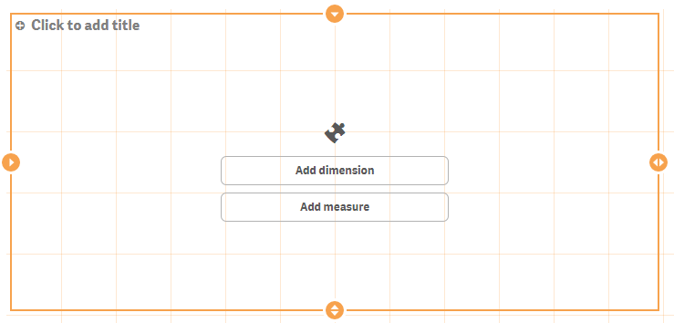

# Hello Data


**Table of Contents**

<!-- toc -->

- [Create your Hello-Data visualization extension](#create-your-hello-data-visualization-extension)
- [Getting data into visualization extension](#getting-data-into-visualization-extension)
- [Testing your extensions with data](#testing-your-extensions-with-data)
  * [Testing with more data](#testing-with-more-data)
- [Visualizing the data returned from the Qlik Engine](#visualizing-the-data-returned-from-the-qlik-engine)
- [How to retrieve the data in your extension](#how-to-retrieve-the-data-in-your-extension)
- [Let's create an HTML table](#let-s-create-an-html-table)
  * [Skeleton](#skeleton)
  * [Table header: dimensions & measures](#table-header--dimensions---measures)
  * [Table data](#table-data)
- [Changing the initial properties](#changing-the-initial-properties)
- [Rendering table data](#rendering-table-data)
  * [Issues with the current implementation](#issues-with-the-current-implementation)
- [Some golden rules](#some-golden-rules)
- [Final code](#final-code)

<!-- tocstop -->

---

OK, now we are done with the very, very basics. Let's move on to the interesting stuff, bringing data into our _visualization extension_.

## Create your Hello-Data visualization extension
For this chapter create a new visualization extension, let's call it "Hello-Data".

**Hello-Data.qext**
```json
{
	"name" : "Hello Data",
	"description" : "Examples how to use data in visualization extensions.",
	"icon" : "extension",
	"type" : "visualization",
	"version": "0.1.0",
	"preview" : "08-hellodata.png",
	"author": "Stefan Walther"
}
```

**Hello-Data.js**
```js
define( [],
	function ( ) {
		'use strict';

		return {
			definition: {},
			initialProperties: {},
			paint: function ( $element, layout ) {

				// Your code comes here

			}
		};
	} );
```

## Getting data into visualization extension
In one of the previous chapters we have already looked into the solution of re-using the built-in capability to let the user define dimensions and measures in a Qlilk Sense Visualization Extension. Therefore add the following code to the `definition` object of your extension:

```javascript
definition: {
	type: "items",
	component: "accordion",
	items: {
		dimensions: {
			uses: "dimensions"
		},
		measures: {
			uses: "measures"
		},
		sorting: {
			uses: "sorting"
		},
		appearance: {
			uses: "settings"
		}
	}
}
```

This results into the following property panel:


If you add the visualization onto a sheet you'll furthermore realize that in _Edit Mode_ the user can now define the dimensions and measures directly in the object (without using the property panel). In addition to that also drag and drop of previously defined dimensiosn and measures from the Master items is possible:




## Testing your extensions with data
If you want to test your visualization extension in a blank, new Qlik Sense application you'll realize that Qlik Sense requires some data to be able to create a new sheet.

The easiest way to achieve that - if you haven't some good test data - is the following:

Go to the **_Data load editor_**:


At the end of the script of the _Main_ tab add the sample script by using the keyboard shortcut "Ctrl+0+0", load the data, go back to the "App overview" and then you can create your sheet to test your visualization extension.


### Testing with more data
If you want to test with more data, here a modified sample script you can use:

```bash
// Change the amount here to create more records
SET vAmountTransactions=10000;

Characters:
Load Chr(RecNo()+Ord('A')-1) as Alpha, RecNo() as Num autogenerate 26;
 
ASCII:
Load 
 if(RecNo()>=65 and RecNo()<=90,RecNo()-64) as Num,
 Chr(RecNo()) as AsciiAlpha, 
 RecNo() as AsciiNum
autogenerate 255
 Where (RecNo()>=32 and RecNo()<=126) or RecNo()>=160 ;
 
Transactions:
Load
 TransLineID, 
 TransID,
 mod(TransID,26)+1 as Num,
 Pick(Ceil(3*Rand1),'A','B','C') as Dim1,
 Pick(Ceil(6*Rand1),'a','b','c','d','e','f') as Dim2,
 Pick(Ceil(3*Rand()),'X','Y','Z') as Dim3,
 Round($(#vAmountTransactions)*Rand()*Rand()*Rand1) as Expression1,
 Round(  10*Rand()*Rand()*Rand1) as Expression2,
 Round(Rand()*Rand1,0.00001) as Expression3;
Load 
 Rand() as Rand1,
 IterNo() as TransLineID,
 RecNo() as TransID
Autogenerate $(#vAmountTransactions)
 While Rand()<=0.5 or IterNo()=1;
```

## Visualizing the data returned from the Qlik Engine
If you start working with data returned from the Qlik Engine, I recommend that you first visualize your data in a native _Table_ object side by side with your visualization extension. You'll recognize in a few minutes why this is quite useful.

1. Create a new sheet
2. Add your visualization to the sheet
3. Add a table object to the sheet
4. Then add the same dimensions and extensions to both, your extension and the table object

Based on the sample code/data above I have chosen the following data:

**Dimensions:** 
* `TransId`
* `Dim1`
* `Dim2`

**Measures:**
* `Sum(Expression1)`
* `Sum(Expression2)`

In the native table object this will result into something like this:


 
## How to retrieve the data in your extension
As soon as you add dimensions and measures to a visualization extension the Qlik Engine will return a so called HyperCube. As of now, don't be confused by this term, just think of table returned from the Engine (altough a HyperCube is much more).
(_You'll learn more about the construct of a HyperCube in later chapters._)

To be able to look under the hood, let's again just use Chrome DevTools to output the HyperCube to DevTool's console.

Therefore change the paint section as follows:

```js
paint: function ( $element, layout ) {

	console.log('Data returned: ', layout.qHyperCube);

}
```

**The console output:**


You will immediately realize, that this is not _just_ a normal data table, yes, it's the structure of a HyperCube.
For the beginning three different objects are interesting (expand these nodes to review):

* `layout.qHyperCube.qDimensionInfo` - used dimensions
* `layout.qHyperCube.qMeasureInfo` - used measures
* `layout.qHyperCube.qDataPages` - the result

## Let's create an HTML table
As we now know how the underlying data structure looks like, let's create a very simple HTML table to display the data. The HTML table should contain a header (including the labels for the dimensions measures) and certainly a body containing the data.

### Skeleton
```js
paint: function ( $element, layout ) {

	var hc = layout.qHyperCube;
	console.log( 'Data returned: ', hc );
	
	$element.empty();
	var table = '<table border="1">';
		
		table += '<thead>';
		table += '</thead>';
		
		table += '<tbody>';
		table += '</tbody>';
	table += '</table>';
	$element.append( table );
}
```

### Table header: dimensions & measures
To get first all dimensions let's iterate through all existing dimensions using  the `hc.DimensionInfo` array, then use the property `qFallbackTitle` which holds the label of the dimension:

```js
...
	table += '<thead>';
		table += '<tr>';
			for (var i = 0; i < hc.qDimensionInfo.length; i++) {
				table += '<th>' + hc.qDimensionInfo[i].qFallbackTitle + '</th>';
			}
		table += '</tr>';
	table += '</thead>';
...
```

The result so far:


Now let's do the same for measures (by adding additional table headings) and you should come up with:


>**Hint:**
> At this stage I highly recommend that you follow the creation of this simple table-output step by step and make yourself familiar with the concept. Sure, creating a table might not be a very useful and common requirement, but for the majority of visualizations extensions it is essential do deal with data and understanding the underlying data-structure - the structure of the HyperCube.
  
### Table data
Before we add the table data, let's have a look again the the console output and especially at `qDataPages`:
If you expand the qDataPages node we recognize that

* qDataPages is an array
* and that the data is held with qDataPages[0].qDataPages.qMatrix,
* which is again an array of objects (the rows), 
* each again holding an array of some other objects (the cells)

**But wait, something is wrong, isn't it?**
As we have defined 3 measures and 2 dimensions we should see 5 cell, but instead there are only two:


The explanation can be found if you expand `qDataPages[0].qArea`, which shows us the default settings how many data the Engine will return:


By default these are:
* 50 rows (`qArea.qHeight`)
* 2 columns (`qArea.qWidth`)

## Changing the initial properties
We can change this behavior by overruling the default properties in initialProperties, which is already part of our script file:

```js
initialProperties: {
	qHyperCubeDef: {
		qDimensions: [],
		qMeasures: [],
		qInitialDataFetch: [
			{
				qWidth: 10,
				qHeight: 100
			}
		]
	}
},
```


Every row has now 5 cells:  


## Rendering table data

Very similar to the code above we now have to iterate over rows and then cells to render all rows and columns:

```js
table += '<tbody>';

	// iterate over all rows
	for (var r = 0; r < hc.qDataPages[0].qMatrix.length; r++) {
		table += '<tr>';

		// iterate over all cells within a row
		for (var c = 0; c < hc.qDataPages[0].qMatrix[r].length; c++) {
			table += '<td>';
				table += hc.qDataPages[0].qMatrix[r][c].qText;
			table += '</td>';
		}
		table += '</tr>';
	}
table += '</tbody>';
```

The result:  


Hurray, we are done, we have rendered all the data, so we are fine, are we?
Unfortunately not really. There are still some issues we have to solve:

### Issues with the current implementation

If you have a deeper look at our current solution (and especially if you compare it with the native _Table_, you'll recognize that:

* **Table is not scrollable**  
A user is now not able to scroll vertically, only the rows fitting into the current screen will be shown.
* **All data?**  
Since we have defined qHeight: 100 only 100 rows will be rendered, but the native _Table_ returns in my case 10.000 records. This is where the `qDataPages` come into play.
* **Making selections**  
In the current implementation a user cannot make selections, e.g. clicking into the a cell in column 2 (Dim1) and select a value in the field `Dim1`.
* **The table is ugly**  
Yes, it's more or less just the default style. We could certainly add now inline styles to the table but that's not really a best practice. Instead it would be much better to add an external style sheet which we can refer to. (We'll look into that in the next chapter).

We'll tackle these problems in Part I / chapter 10, first let's have a look into another topic, thus how to **load external resources** to be able to style our table.

## Some golden rules

When working with data the following best practices might be helpful for you:

* Prove the data returned from the Qlik Engine by using the same dimensions and measures in a native _Table_ object
* Don't guess, use console.log wisely to understand the underlying data-structure
* Always add `initialProperties` to define how many rows/columns are available in your JavaScript object
* When changing the `initialProperties`, remove and re-add your visualization extension.


## Final code

```js
define( [],
	function ( ) {
		'use strict';

		return {

			definition: {
				type: "items",
				component: "accordion",
				items: {
					dimensions: {
						uses: "dimensions"
					},
					measures: {
						uses: "measures"
					},
					sorting: {
						uses: "sorting"
					},
					appearance: {
						uses: "settings"
					}
				}
			},
			initialProperties: {
				qHyperCubeDef: {
					qDimensions: [],
					qMeasures: [],
					qInitialDataFetch: [
						{
							qWidth: 10,
							qHeight: 100
						}
					]
				}
			},
			paint: function ( $element, layout ) {

				var hc = layout.qHyperCube;
				//console.log( 'Data returned: ', hc );

				// Default rendering with HTML injection
				$element.empty();
				var table = '<table border="1">';

					table += '<thead>';
						table += '<tr>';
						for (var i = 0; i < hc.qDimensionInfo.length; i++) {
							table += '<th>' + hc.qDimensionInfo[i].qFallbackTitle + '</th>';
						}
						for (var i = 0; i < hc.qMeasureInfo.length; i++) {
							table += '<th>' + hc.qMeasureInfo[i].qFallbackTitle + '</th>';
						}
					table += '</tr>';
					table += '</thead>';

					table += '<tbody>';
						for (var r = 0; r < hc.qDataPages[0].qMatrix.length; r++) {
							table += '<tr>';
							for (var c = 0; c < hc.qDataPages[0].qMatrix[r].length; c++) {
								table += '<td>';
									table += hc.qDataPages[0].qMatrix[r][c].qText;
								table += '</td>';
							}
							table += '</tr>';
						}
					table += '</tbody>';
				table += '</table>';
				$element.append( table );

			}
		};

	} );

```

---
**Qlik Sense Visualization Extension Tutorial**, Version 0.9.0<br/>
Last update: 2015-05-29<br/>

[Overview of all chapters](https://github.com/stefanwalther/qliksense-extension-tutorial/blob/master/tutorial/readme.md)