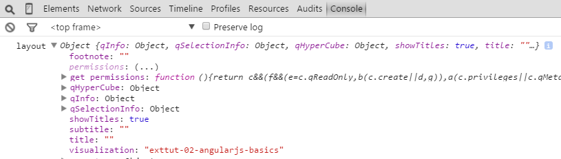

# The Angular Way: Basics

<!-- toc -->

- [Introducing AngularJS](#introducing-angularjs)
- [AngularJS and Qlik Sense](#angularjs-and-qlik-sense)
  * [Some background information](#some-background-information)
  * [AngularJS concepts which CAN be used in Qlik Sense](#angularjs-concepts-which-can-be-used-in-qlik-sense)
  * [AngularJS concepts which CANNOT be used in Qlik Sense](#angularjs-concepts-which-cannot-be-used-in-qlik-sense)
- [Let's get started](#let-s-get-started)
  * [Basic AngularJS skeleton](#basic-angularjs-skeleton)
  * [Using external templates](#using-external-templates)
  * [Accessing the layout & properties](#accessing-the-layout---properties)
- [Support of AngularJS](#support-of-angularjs)

<!-- tocstop -->

## Introducing AngularJS

AngularJS

* is a framework to build dynamic web applications
* is a MVC or MV* framework
* has a strong focus on data binding and extends HTML
* plays nicely together with other JavaScript libraries like jQuery

Some of the key concepts of AngularJS:

* Templating & Data Binding
* Controllers
* Directives
* Services
* Dependency Injection
* Filters
* Routing
* Testability

## AngularJS and Qlik Sense
The Qlik Sense client uses under the hood AngularJS, that's first good to know. When it comes to use AngularJS also to develop your visualization extensions it's important to understand that you cannot use all of the concepts of AngularJS out of the box but the most important ones.

### Some background information
One of the core-concepts of AngularJS is that an AngularJS application [gets bootstraped](https://docs.angularjs.org/guide/bootstrap). So does also the Qlik Sense client and during that process an AngularJS module called `qvangular` get created.

This `qvangular` module takes - among other things - care of two main aspects:

* that AngularJS and RequireJS plays nicely together
* that visualization extensions can be loaded at runtime without bootstrapping the application

### AngularJS concepts which CAN be used in Qlik Sense

* Directives
* Templates
* Filters
* Re-using AngularJS internal methods
* Data-binding
* The entire scope concept

### AngularJS concepts which CANNOT be used in Qlik Sense
The following cannot be done when developing a Qlik Sense visualization extensions in Qlik Sense:

* Loading and re-using entire AngularJS **modules** or **factories**  
(You will have to modify them to work as directives or services)
* Bootstrapping the application

## Let's get started

The biggest difference between using the "classic" `paint`- and the AngularJS-approach is that instead of `paint` you have to define a template + a controller in your main JavaScript file:

### Basic AngularJS skeleton

```js
define( [
	],
	function (  ) {
		'use strict';

		return {
			definition: {},
			initialProperties: {},
			snapshot: {canTakeSnapshot: true},
			template: '<div qv-extension>This is my message: <b></b></div>',
			controller: ['$scope', function ( $scope ) {
				$scope.msg = 'Hello AngularJS';
			}]
		};
	} );
```
**Code explanation:**

* Note that the `paint` method is not used anymore!
* `template` defines your AngularJS template which will play together with the `controller`
	* The `template` can be defined inline (as shown above or by using a separate file, as shown below)
* `qv-extension` must be part of your template's root element  
(`qv-extension` is a AngularJS directive which takes care of several aspects that your visualization extension can use AngularJS)

### Using external templates

By moving the template to a separate file, maintaining the HTML code becomes much easier:

**HTML:**
(file: `template.ng.html`, located in the same folder as your main script file)
```html
<div qv-extension>
	This is my message: <br/>
	or<br/>
	This is my message: <span ng-bind="msg"></span>
</div>
``` 

**JavaScript:**
```js
define( [
		'text!./template.ng.html'
	],
	function ( ngTemplate ) {
		'use strict';

		return {
			definition: {},
			initialProperties: {},
			snapshot: {canTakeSnapshot: true},
			template: ngTemplate,
			controller: ['$scope', function ( $scope ) {
				$scope.msg = 'Hello AngularJS';
			}]
		};
	} );
```

**Result:**

> 

### Accessing the layout & properties
Working with properties doesn't change, define `definition` and `initialProperties` as described in earlier chapters. All the property values are automatically bound to the current scope under `$scope.layout`.

By just changing the HTML template we can retrieve some very basic information about the current object:


**Property definition:**
(properties.js)

```js
define( [], function () {
	'use strict';

	var dimensions = {uses: "dimensions"};
	var measures = { uses: "measures" };
	var sorting = { uses: "sorting" };
	var addons = { uses: "addons" };
	var appearancePanel = {	uses: "settings" };
	return {
		type: "items",
		component: "accordion",
		items: {
			dimensions: dimensions,
			measures: measures,
			sorting: sorting,
			appearance: appearancePanel
		}
	};
} );
```

**Initial properties:**
(initialproperties.js)

```js
define( [], function () {
    'use strict';
    return {
        qHyperCubeDef: {
            qDimensions: [],
            qMeasures: [],
            qInitialDataFetch: [
                {
                    qWidth: 10,
                    qHeight: 50
                }
            ]
        }
    };
} );
```

**HTML:**
(template.ng.html)
```html
<div qv-extension>
	<b ng-bind="myTitle" />
	
	<table border="1">
		<thead>
		<tr>
			<th ng-repeat="dim in layout.qHyperCube.qDimensionInfo" ng-bind="dim.qFallbackTitle" />
			<th ng-repeat="mea in layout.qHyperCube.qMeasureInfo" ng-bind="mea.qFallbackTitle" />
		</tr>
		</thead>
		<tbody>
		<tr ng-repeat="row in layout.qHyperCube.qDataPages[0].qMatrix">
			<td ng-repeat="col in row">
				
			</td>
		</tr>
		</tbody>
	</table>
</div>
```

**Main script:**
```js
define( [
		'./properties',
		'./initialproperties',
		'text!./template.ng.html'
	],
	function ( props, initProps, ngTemplate ) {
		'use strict';

		return {
			definition: props,
			initialProperties: initProps,
			snapshot: {canTakeSnapshot: true},
			template: ngTemplate,
			controller: ['$scope', function ( $scope ) {
				$scope.myTitle = 'This is my AngularJS table';
			}]
		};
	} );
```

**Result:**

> 

>**Hint:**
> Add a `console.log('layout', $scope.layout);` into your controller and you'll see where you can find all the properties.
> 
> 
> 
  
## Support of AngularJS
It is important to mention in this context that Qlik support does certainly not cover AngularJS. Qlik Sense 2.0.1 is using version 1.2.15 of AngularJS, but this might and will change in the future. So either ensure that you are not using a lot of version specific functionality of AngularJS or follow AngularJS advices how to upgrade your code to a new version.

Using angular as a dependency you can easily check which version is used:

```js
define( [
		'angular'
	],
	function ( angular ) {

	return {
		...
		controller: ['$scope', function ( $scope ) {
			$scope.angularVersion = angular.version;
		}]
	};
} );
``` 
**Result:**
AngularJS developers seem to be funny guys, have a look at the `codeName` of version 1.2.15 ;-)


> 

---
**Qlik Sense Visualization Extension Tutorial**, Version <br/>


[Overview of all chapters](https://github.com/stefanwalther/qliksense-extension-tutorial/blob/master/tutorial/readme.md)