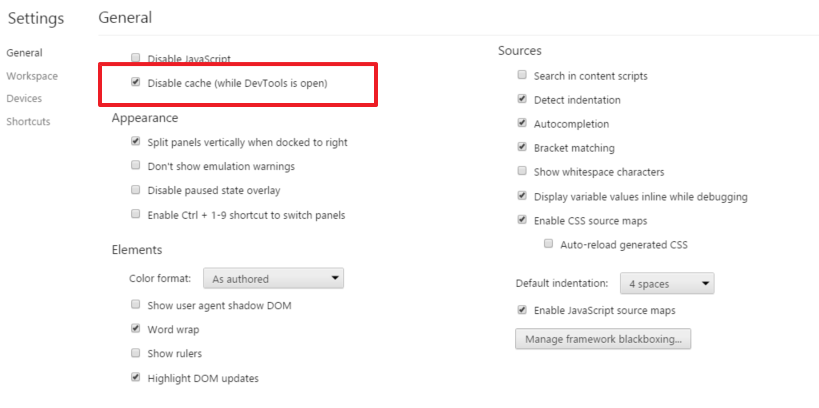

# Troubleshooting &amp; FAQ

<!-- toc -->

- [What is a .wbl file](#what-is-a-wbl-file)
- [Changes made in a visualization extension are not reflected](#changes-made-in-a-visualization-extension-are-not-reflected)
- [10,000 cells limitation](#10-000-cells-limitation)

<!-- tocstop -->

---


## What is a .wbl file
> The Workbench load file (wbfolder.wbl) is used by the Extension- & Mashup editor and contains a list of files which should be loaded into the editor.
When you save an extension- or mashup project from the editor, a WBL file is automatically created and included in the project.

Note: This file is not necessary for using a visualization extension, just in case you have added some files to Workbench and you want to edit those files in Workbench.

If you want to load any existing visualization extension only the main script file + the .qext file will be loaded in Workbench.
By adding additional file names - separated by a semicolon and line carriage - to the wbfolder.wbl you can enable also these additional files to be loaded in Workbench.

```text
my-extension.qext
my-extension.qs
library1.js
library2.js
image1.png
```

---

## Changes made in a visualization extension are not reflected
When developing visualization extensions and testing them in Qlik Sense Desktop it might happen that you don't immediately see the changes.
The reason for this behavior is that Qlik Sense Desktop is using the Chromium browser and because of current settings the Chromium browser is aggressively caching websites.

The best solution for this behavior:

- Open Qlik Sense Desktop (and keep it open)
- At the same time use any installed browser (e.g. Chrome) and load http://localhost:4848/hub

If you want to **completely disable browser caching** e.g. in Chrome you can configure Chrome as such:

- Open Chrome's DevTools (F12)
- Go to "Settings"
- Check "Disable cache (while DevTools is open)


  

---

## 10,000 cells limitation
There is a persistent rumor that one can only load 10,000 data-cells when working with a HyperCube using the Client APIs (in visualization extensions or mash-ups).

**This rumor is not true!!!**

Instead it's true that you can only fetch 10,000 records **per data page** from the Engine, but you can certainly request to get more data pages.
So it's completely up to the developer how many data-points from the data-source are used in the UI.

Have a look into the official documentation to learn more about the paging concept of Qlik Sense:
http://betahelp.qliktech.com/sense/2.0/en-us/developer/Subsystems/Platform/Content/Concepts/Paging.htm

--- 


---
**Qlik Sense Visualization Extension Tutorial**, Version 0.12.7<br/>


[Overview of all chapters](https://github.com/stefanwalther/qliksense-extension-tutorial/blob/master/tutorial/readme.md)